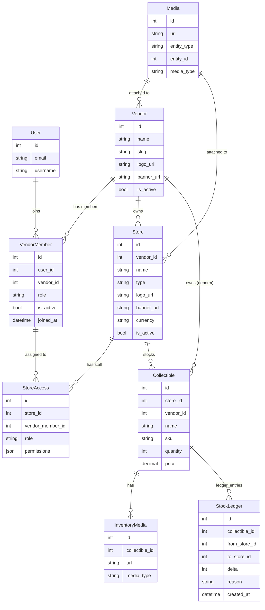

# Vendor / Store Implementation Plan (Verbose)

Date: 2025-12-09

Summary
-------
This document converts the high-level `VENDOR_STORE_MODEL_PLAN.md` into a concrete, phased implementation plan for both backend and frontend with task-level breakdowns, estimate ranges, migration strategy, testing requirements, operational notes, and a complete DB ER diagram for the omni-stock system.

Assumptions
-----------
- Single backend stack: Django + DRF. Database: PostgreSQL (Supabase).
- Frontend: React + Vite + TypeScript (current repo structure).
- One full-time developer (FTE) working at 6 productive hours/day is used for estimate baselines. Multiply or divide estimations for more/less staff.
- Backwards compatibility required: production data must be preserved; migrations should be incremental and reversible.

Deliverables
------------
- Backend: models, migrations, services, APIs, permissions, tests, data migration scripts.
- Frontend: API client extensions, hooks, UI components and pages for vendor/member/store management and store-scoped inventory flows, tests.
- Operations: migration steps, management commands, CI validation, rollout plan.

Phased Plan (High Level)
Phased Plan (High Level) — Sliced & Checkable
------------------------------------------------
Below the high-level phases are split into small, trackable slices. Each slice is intended to be a single PR or task that can be reviewed and merged independently. Times are estimates per slice (1 FTE, 6h/day).

Phase 0 — Setup & Branching
- [x] 0.1 Create working branch `feature/vendor-store-models` (0.5d)
  - Acceptance: branch exists on remote and CI runs.

Phase 1 — Models & Migrations (slices)
- [ ] 1.1 Add `VendorMember` model (0.5d)
  - Files: `backend/vendors/models.py`
  - Acceptance: model created + `makemigrations` produces migration.
- [ ] 1.2 Add `Store` model (0.75d)
  - Fields: vendor FK, name, slug, type, logo_url, banner_url, currency, is_active
  - Acceptance: model created + migration.
- [ ] 1.3 Add `StoreAccess` model (0.5d)
  - Connects `Store` and `VendorMember`, includes role & permissions JSON.
  - Acceptance: migration created + unique constraint (store, member).
- [ ] 1.4 Add optional `StockLedger` model (0.5d)
  - Acceptance: migration created (optional for MVP but recommended).
- [ ] 1.5 Add `store = FK(Store, null=True, blank=True)` to `Collectible` (0.5d)
  - Files: `backend/inventory/models.py`
  - Acceptance: `makemigrations` shows new nullable FK.

Phase 2 — Migrations & Backfill (slices)
- [ ] 2.1 Commit & push migrations (0.25d)
  - Acceptance: migrations present in repo.
- [ ] 2.2 Create management command `create_default_stores` (0.75d)
  - Behavior: create "Default Store" per vendor if none exists.
  - Files: `backend/inventory/management/commands/create_default_stores.py`
  - Acceptance: command runs locally without error and creates stores for each vendor.
- [ ] 2.3 Backfill `Collectible.store` using management command (1d)
  - Behavior: assign collectibles to vendor's default store in batches, with logging.
  - Acceptance: counts match (number of collectibles assigned) and script supports dry-run.
- [ ] 2.4 (Optional) Make `Collectible.store` non-nullable migration after validation (0.5d)
  - Acceptance: migration applied in staging, sanity checks pass.

Phase 3 — Services & Business Logic (slices)
- [ ] 3.1 Implement `invite_member` service (0.5d)
  - Files: `backend/vendors/services/invite_member.py`
  - Acceptance: unit tests for invite flow.
- [ ] 3.2 Implement `accept_invite` / `revoke_invite` services (0.5d)
- [ ] 3.3 Member promotion/demotion & ownership transfer service (0.75d)
- [ ] 3.4 Implement `create_store`, `update_store`, `archive_store` services (1d)
- [ ] 3.5 Implement `assign_member_to_store` and `remove_store_access` (0.5d)
- [ ] 3.6 Implement `transfer_stock` service with DB transaction and ledger entries (1–2d)
  - Files: `backend/inventory/services/transfer_stock.py`, `backend/inventory/services/create_collectible.py`

Phase 4 — API Layer (slices)
- [ ] 4.1 Serializers for `VendorMember`, `Store`, `StoreAccess` (0.75d)
- [ ] 4.2 Viewsets / endpoints for listing/creating members and stores (1d)
- [ ] 4.3 Endpoint to assign store access (0.5d)
- [ ] 4.4 Update `CollectibleViewSet` to accept `store` and call service layer (0.75d)
- [ ] 4.5 Implement DRF permissions `IsVendorAdmin`, `HasStoreAccess` and wire them into viewsets (0.75d)

Phase 5 — Frontend (slices)
- [ ] 5.1 Extend `vendorsApi.ts` with members/stores endpoints (0.5d)
- [ ] 5.2 Create `useListMembers`, `useInviteMember`, `useCreateStore` hooks (0.75d)
- [ ] 5.3 Implement `VendorMembersList` component + `MemberInviteForm` (1d)
- [ ] 5.4 Implement `StoreList` and `StoreForm` components (1d)
- [ ] 5.5 Implement `StorePicker` component (0.5d) and integrate into `CollectibleCreateForm` and `CollectibleEditForm` (0.5d)
- [ ] 5.6 Implement `StoreAccessForm` to assign members to stores (0.75d)
- [ ] 5.7 Update pages (`VendorOverviewPage`) to include members & stores UIs (0.5d)

Phase 6 — Tests & QA (slices)
- [ ] 6.1 Unit tests for models and services (1–2d)
- [ ] 6.2 Integration tests for APIs and permission enforcement (1–2d)
- [ ] 6.3 Migration tests and data validation checks (0.5–1d)
- [ ] 6.4 Frontend component/integration tests (1–2d)

Phase 7 — CI / Staging / Rollout (slices)
- [ ] 7.1 Add CI checks for migrations and run test suite (0.5d)
- [ ] 7.2 Run backfill in staging and validate (0.5–1d)
- [ ] 7.3 Schedule production migration with DB snapshot & rollback plan (0.5d)

Phase 8 — Post-release & Cleanup
- [ ] 8.1 Optional: remove denormalized `Collectible.vendor` if no longer needed (0.5d)
- [ ] 8.2 Add media cleanup job / retention policy (0.5d)

Acceptance criteria per slice
- Each slice must include automated tests (where applicable), schema docs updates (drf-spectacular), and a short PR description that links to this plan slice.

File mapping (quick reference)
- Backend models & migrations: `backend/vendors/models.py`, `backend/inventory/models.py`, `backend/vendors/migrations/`, `backend/inventory/migrations/`
- Backend services: `backend/vendors/services/`, `backend/inventory/services/`
- Backend APIs: `backend/vendors/api/`, `backend/inventory/api/`
- Management commands: `backend/inventory/management/commands/`
- Frontend API & hooks: `frontend/src/features/vendors/api/vendorsApi.ts`, `frontend/src/features/vendors/hooks/`
- Frontend components: `frontend/src/features/vendors/components/`, `frontend/src/features/inventory/components/`

Estimates summary (per-slice totals)
- MVP (critical slices only): ~2–3 weeks
- Full implementation (all slices + tests + polish): ~5–8 weeks

Next actionable step (recommended)
- Start with slices 1.1–1.5 to introduce models and nullable `Collectible.store`, then proceed to 2.2/2.3 for backfill.
- I can scaffold slices 1.1–1.5 now on `feature/vendor-store-models` and push a branch PR. Confirm and I'll begin.
Below are suggested model definitions (Django fields) and indexes.

Vendor
- id: Auto
- name: Char(200)
- slug: SlugField(unique)
- description: Text
- logo_url: URL
- banner_url: URL
- owner: FK(User, null=True)  # primary owner convenience
- contact_info: JSON/Text
- subscription_plan: Char/ForeignKey
- is_active: Bool
- created_at, updated_at
- Indexes: slug, is_active

VendorMember
- id
- vendor: FK(Vendor, on_delete=CASCADE, related_name='members')
- user: FK(settings.AUTH_USER_MODEL, on_delete=CASCADE, related_name='vendor_memberships')
- role: CharField(choices=['OWNER','ADMIN','MEMBER','BILLING','VIEWER'])
- is_active: Bool
- joined_at: DateTime
- invite_code: Char (nullable)
- meta: JSON
- Unique constraint: (vendor, user)
- Indexes: vendor_id, user_id

Store
- id
- vendor: FK(Vendor, on_delete=CASCADE, related_name='stores')
- name: Char(200)
- slug: SlugField(indexed)
- type: CharField(choices=['RETAIL','POPUP','ONLINE','WAREHOUSE'])
- address: JSON/Text
- logo_url: URL
- banner_url: URL
- currency: Char(8)
- default_tax_rate: Decimal
- is_active: Bool
- operating_hours: JSON
- location_lat, location_long: Decimal
- created_at, updated_at
- Index: (vendor_id, slug), is_active

StoreAccess
- id
- store: FK(Store, on_delete=CASCADE, related_name='access')
- member: FK(VendorMember, on_delete=CASCADE, related_name='store_access')
- role: Char(choices=['MANAGER','SALES'])
- custom_permissions: JSON
- is_active: Bool
- created_at, updated_at
- Unique: (store, member)

Collectible (existing model)
- add: store = FK(Store, null=True, blank=True, related_name='collectibles')
- keep: vendor FK (to ease queries) — optional denormalized field
- Indexes: sku (unique), (store_id), (vendor_id)

InventoryMedia (existing)
- item FK to Collectible
- url, media_type, sort_order, is_primary, width, height, size_kb, metadata

StockLedger (new, optional)
- id
- collectible: FK(Collectible)
- from_store: FK(Store, null=True)
- to_store: FK(Store, null=True)
- delta: Integer (positive/negative)
- reason: Char (sale, transfer, adjustment)
- performed_by: FK(User, null=True)
- created_at, created_meta JSON
- Indexes: collectible_id, created_at

AuditLog (global auditing)
- id
- entity_type: string
- entity_id: integer
- action: string
- performed_by: FK(User, null=True)
- payload: JSON
- created_at

Full DB ER Diagram (Mermaid)
----------------------------

Frontend Mapping & Implementation Steps (Detailed)
--------------------------------------------------
Files to update (existing) and create (new):
- Extend `frontend/src/features/vendors/api/vendorsApi.ts`:
  - Add client functions:
    - `fetchVendorMembers(vendorId)`
    - `inviteVendorMember(vendorId, payload)`
    - `promoteVendorMember(memberId, payload)`
    - `listStores(vendorId)`
    - `createStore(vendorId, payload)`
    - `assignStoreAccess(storeId, payload)`
- Create hooks in `frontend/src/features/vendors/hooks/`:
  - `useListMembers`, `useInviteMember`, `useCreateStore`, `useAssignStoreAccess`.
- Add components in `frontend/src/features/vendors/components/`:
  - `VendorMembersList.tsx` (table + role controls)
  - `MemberInviteForm.tsx`
  - `StoreList.tsx`
  - `StoreForm.tsx`
  - `StoreAccessForm.tsx`
  - `StorePicker.tsx` (select dropdown with vendor stores)
- Inventory forms:
  - Update `frontend/src/features/inventory/components/CollectibleCreateForm.tsx` and `CollectibleEditForm.tsx` to include `StorePicker`.
- Pages:
  - Update `VendorOverviewPage.tsx` to include members and stores UI or add `VendorMembersPage` and `VendorStoresPage`.

UX notes
- For single-user vendors, default store is selected automatically.
- Use progressive enhancement: if store list empty, show "Default Store will be created" message.

API Contract Examples (minimal)
- POST /api/v1/vendors/{vendor_id}/members/ -> invite member
- GET /api/v1/vendors/{vendor_id}/members/ -> list
- POST /api/v1/stores/ -> create store (payload has vendor_id)
- GET /api/v1/stores/?vendor={id} -> list stores
- POST /api/v1/stores/{id}/access/ -> assign member to store
- POST /api/v1/collectibles/ -> create collectible with `store` field

Testing Plan
------------
- Backend unit tests: model constraints, service flows (invite/accept, create store, transfer stock).
- Backend integration tests: API contract tests for endpoints and permission classes.
- Migration tests: simulate DB state pre-change, run migrations + backfill, assert invariants.
- Frontend tests: component snapshots, interaction tests for forms, integration tests for store-picker flows.

CI / Deployment Considerations
------------------------------
- CI: run `makemigrations --check` and `pytest` on branches.
- Use feature branch `feature/vendor-store-implementation` and open a PR to `main`.
- Run data migration script in staging first; validate the results against test fixtures.
- On deploy: run `python manage.py migrate` (start script already runs migrations), watch logs.

Rollback Plan
-------------
- Keep old `Collectible.vendor` field during migration until new `store` field validated.
- If immediately required to rollback, stop the new API (switch to maintenance) and restore DB snapshot taken before migration.

Risks & Mitigations
-------------------
- Risk: Migration performance on large DB — mitigation: batch backfill and index maintenance during off-hours.
- Risk: Missing permission enforcement -> mitigation: tests and careful service-layer checks.
- Risk: Frontend UX complexity -> mitigation: phased rollout and toggles to enable store features.

Estimated File Changes & Rough LOC
----------------------------------
- Backend models + migrations: ~400–800 LOC (models + migrations + tests)
- Backend services + APIs: ~600–1200 LOC
- Frontend API + components + hooks: ~800–1600 LOC
- Tests (both sides): ~800–1500 LOC

Minimum Viable Scope (MVP)
-------------------------
- Models + nullable `Collectible.store`, default-store backfill script, minimal store list/create APIs, store-picker in collectible forms, basic permission enforced at service level for create/update/destroy.
- MVP ETA: ~2–3 weeks (1 FTE) including QA.

Appendix — Concrete next steps for me (pick one)
-----------------------------------------------
- A. Scaffold models + migrations on new branch `feature/vendor-store-models` and run tests.
- B. Implement data backfill script and add migration tests.
- C. Implement backend services + API for vendor members and stores.
- D. Scaffold frontend API + `StorePicker` and update `CollectibleCreateForm`.

Choose which item you'd like me to start with and I will proceed. If you'd like, I can start A (models + migrations) now and open a PR with incremental commits.

*Prepared by the agent upon request.*
