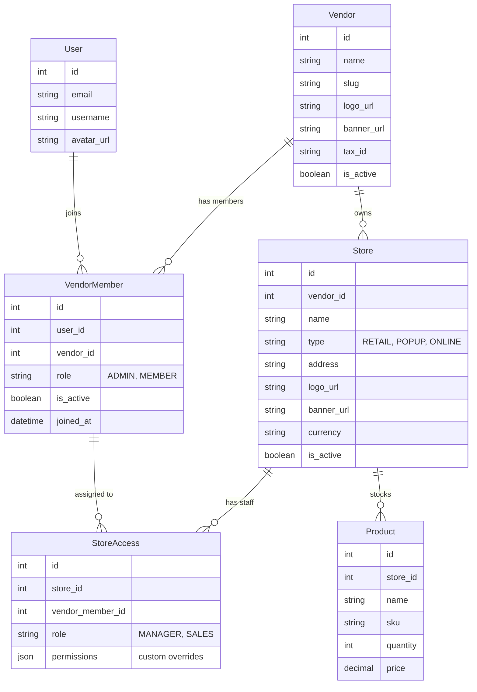

# Vendor / Store Model Plan

Date: 2025-12-09

## Original Requirements

The following is the complete user request that drove this refactoring plan:

> I want to refactor the backend model and logic to the following. I want a user accounts to be independent. I want a user to be able link to a vendor and be able to add other users to the vendor. There should be Role like admin, manager, and sales roles. Admin controls who can be added to the vendor and be able to make a new table called a store and the store will hold products with different types of products.
>
> Each vendor and have a group of stores which which will hold say the inventory of a vendors pop up retail table, a card store and online store etc. The admin can assign who can look at the each store and allow sales, and managers to have various permissions to add, remove and adjust price of products in the store.
>
> I want to be able to have the vendor model to be able to track who is a member of the vendor, their role and be able to promote or change ownership of the store.
>
> I want each store to have its own inventory of products
>
> Next I want there to be there to be store and vendor media so we can upload a banner, avatar etc for each.
>
> Suggest other fields these tables can have as well.

---

## Summary

This document captures the suggested backend refactor for supporting vendor accounts, stores, roles, and per-store inventory/permissions.

---

## Architectural Overview

1. **User Independence**: Users are standalone entities. They are not hard-linked to a single vendor via their profile.
2. **Vendor Membership (RBAC)**: A `VendorMember` table links Users to Vendors. Users may belong to multiple vendors and have a Vendor-Level Role (Admin, Member).
3. **Stores**: A `Store` model represents physical or digital outlets owned by a `Vendor`.
4. **Store Permissions**: A `StoreAccess` model controls which employees can access which store and what actions they can perform (Manager vs Sales).
5. **Inventory**: The `Product` (Collectible) model is assigned to a `Store`, enabling distinct inventory per store.

## Mermaid ER Diagram

---

## Detailed Model Breakdown & Field Suggestions

### Vendor
Represents the top-level organization.

- Fields:
  - `name` (string)
  - `slug` (string)
  - `description` (text)
  - `logo_url` (URL) — brand/avatar
  - `banner_url` (URL)
  - `owner` (FK -> `User`) — optional primary owner
  - `tax_id` (string) — optional for invoicing
  - `subscription_plan` (string or FK) — Free/Pro/Enterprise
  - `is_active` (bool)
  - `contact_info` (JSON/text)
  - timestamps: `created_at`, `updated_at`

### VendorMember
Tracks membership and role within a Vendor.

- Fields:
  - `user` (FK -> `User`)
  - `vendor` (FK -> `Vendor`)
  - `role` (choices): `ADMIN`, `MEMBER` (can extend to `OWNER`/`BILLING` later)
  - `is_active` (bool)
  - `joined_at` (datetime)
  - `invite_code` or `joined_via` (optional metadata)

Behavior:
- `ADMIN` can invite/remove members, create stores, configure vendor settings.
- Consider an `OWNER` role for transfer-of-ownership flows.

### Store
Represents a specific sales/stock location.

- Fields:
  - `vendor` (FK -> `Vendor`)
  - `name` (string)
  - `type` (enum): `RETAIL`, `POPUP`, `ONLINE`, `WAREHOUSE`
  - `address` (text/structured) — optional
  - `logo_url`, `banner_url` (URL)
  - `currency` (string)
  - `default_tax_rate` (decimal)
  - `is_active` (bool)
  - `operating_hours` (JSON) — optional
  - `location_lat`, `location_long` (decimal) — optional
  - timestamps

Permissions & behavior:
- Stores are scoped to a Vendor.
- Admins create and configure Stores; Managers and Sales get access via `StoreAccess`.

### StoreAccess
Granular per-store access control connecting `VendorMember` to `Store`.

- Fields:
  - `store` (FK -> `Store`)
  - `member` (FK -> `VendorMember`)
  - `role` (choices): `MANAGER`, `SALES`
  - `custom_permissions` (JSON) — e.g. `{"can_adjust_price": true}`
  - `is_active`, timestamps

Roles:
- `MANAGER` — create/update/remove products, adjust prices, manage store-level metadata.
- `SALES` — view inventory, perform sales operations, cannot change prices or remove products.

### Product (Collectible)
Per-store inventory item.

- Fields:
  - `store` (FK -> `Store`) — primary scoping
  - `vendor` (FK -> `Vendor`) — optional (denormalized or for queries)
  - `name`, `sku`, `description`, `category`, `condition`
  - `image_url` (URL)
  - `quantity` (int)
  - `price` (decimal)
  - `cost_price` / `intake_price` (decimal)
  - `status` (enum): `ACTIVE`, `ARCHIVED`, `DRAFT`
  - `metadata` (JSON) — extensible fields
  - timestamps

Inventory operations:
- Transfer stock between stores: decrement/increment with transactional safety.
- Keep `quantity` per-store; consider `StockLedger` for historical movements.

### Media (Vendor & Store)
Keep media as URLs (Supabase) and create light metadata records if needed.

- `Vendor` media fields: `logo_url`, `banner_url`.
- `Store` media fields: `logo_url`, `banner_url`.
- Optionally, a `Media` table to record uploads with `url`, `type`, `uploaded_by`, `created_at`.

---

## Implementation Plan (Suggested Steps)

1. **Models**: Add `VendorMember`, `Store`, `StoreAccess`, and update `Product` to reference `Store`.
2. **Migrations**: Add migrations with a migration strategy:
   - Create models first (nullable fields where needed).
   - Create a default `Store` for existing Vendors and migrate current `Collectible.vendor` rows into that store.
   - Finally, make the new `store` FK non-nullable if appropriate.
3. **Services**:
   - Add services to invite users to vendors, accept invites, promote/demote members, create stores, assign access.
   - Add store-level permissions checks in service layer.
4. **API Changes**:
   - Endpoints: Invite Member, List Members, Create Store, Assign Store Access, Transfer Product between Stores.
5. **Permissions**:
   - Implement decorators / DRF permissions that check `VendorMember` role and `StoreAccess` for store-scoped operations.
6. **Data Migration**:
   - For existing data, create a "Default Store" per Vendor then reassign products.
7. **Testing**:
   - Add unit & integration tests for role enforcement, store scoping, inventory transfer atomicity.
8. **UI / UX**:
   - Add admin views for managing members and stores.

---

## Additional Suggestions

- Add an audit/logging table (e.g., `StockLedger` or `AuditLog`) to record changes made by users (who performed the action and timestamps).
- Consider soft-delete (`is_active`) on VendorMember and Store to keep history.
- Add indexing on `sku`, `store_id` and search-friendly fields for performance.
- Add webhooks or events for inventory alerts (low stock) and store changes.

---

## Collections / Inventory Integration Plan

The existing Collectible model (current inventory implementation) needs to be gradually aligned with the proposed Store-centric architecture. The approach is:

1. **Transitional Fields**
   - Add `store` FK to the Collectible model (nullable initially).
   - Populate it with a “Default Store” per vendor (created during migration).
   - Eventually enforce non-null `store` reference; keep `vendor` FK as denormalized helper for queries.

2. **Service Layer Updates**
   - Update inventory services (`create_collectible`, `update_collectible`, `transfer_collectible`) to require store context and validate `StoreAccess` before allowing actions.
   - Introduce a `StockMovement` service/log to track quantity adjustments between stores or from purchase/sale events.

3. **Selector & API Changes**
   - Filter queries by store scope when requested (e.g., `?store=<id>`).
   - For admins, allow cross-store aggregate reports; for managers/sales, limit responses to stores where they hold access.
   - Provide endpoints for transferring stock between stores (decrement source store, increment destination store within a transaction).

4. **Frontend Alignment**
   - Update React queries/forms to include store context (dropdown or inferred from route).
   - Provide UX for quickly switching stores and seeing corresponding inventory.

5. **Testing & Migration**
   - Write migration tests to ensure every vendor receives at least one store and all existing collectibles are linked to it.
   - Add regression tests validating that unauthorized users cannot create/update/destroy collectibles outside of assigned store scope.

## Deletion, Archival, and Ownership Transfer Strategy

To keep data integrity and audit history, soft-delete and reassignment flows are recommended across vendors, members, and stores:

### Vendors
1. **Soft Delete**: add `is_active` boolean and optional `deleted_at`. Instead of hard delete, mark vendor inactive to retain audit and inventory history.
2. **Ownership Transfer**: allow `VendorMember` with role OWNER/ADMIN to transfer `vendor.owner` field to another admin, ensuring at least one owner remains.
3. **Cascade Rules**: when `is_active` becomes false:
   - All Stores are marked inactive.
   - Access records are disabled, preventing login to vendor contexts.

### Vendor Members
1. **Deactivation**: use `is_active` flag on `VendorMember` rather than deleting rows. This preserves store access history and inventory actions performed by the user.
2. **Audit Trail**: log member removal events (who removed, when, reason).
3. **Reactivation**: allow admins to reactivate former members without re-inviting if necessary.

### Stores
1. **Soft Delete / Archive**: set `is_active` to false; remove from UIs but retain data for reports. Optionally capture `archived_at`, `archived_by`.
2. **Inventory Handling**:
   - If a store is archived, require admin to transfer or zero out inventory first.
   - Provide a `StoreTransferService` that reassigns collectibles to another store (with optional ledger entries).
3. **Store Access Cleanup**: disable `StoreAccess` entries when the store is archived to prevent stray permissions.

### Media Cleanup
1. When deactivating vendors or stores, optionally queue async jobs to remove Supabase media after a retention period.
2. Update `UserMedia` service to accept `entity_type/entity_id` references so media can be cleaned up per vendor/store.

### Hard Deletion (rare)
1. Provide background command (`cleanup_inactive_vendors`) to permanently remove vendors/stores marked inactive for >N months, after verifying no accounting/audit holds.
2. Ensure cascades remove:
   - `VendorMember`, `Store`, `StoreAccess`, `Collectible`, `Media`, `AuditLog`.
3. Backups: snapshot database before mass-deletion.

## Next Steps

1. Create the new models (`VendorMember`, `Store`, `StoreAccess`, optional `StoreMedia`) and migrations.
2. Migrate existing collectibles to store-aware records following the plan above.
3. Implement service and permission layers (invites, access control, inventory mutation services).
4. Update APIs & frontend flows (member-management UI, store picker, per-store inventory pages).
5. Add deletion/archival commands and tests to enforce lifecycle rules.

## Handling Single-User Vendors / Solo Shops

Some vendors will be one-person businesses. The model should gracefully support that scenario without forcing unnecessary invites or extra UI steps:

1. **Implicit Membership on Creation**
   - When a user creates a new vendor, automatically create a `VendorMember` row for that user with role `OWNER` and mark it as active.
   - Automatically create a “Default Store” (e.g., “Main Store”) and grant the same user `MANAGER` access via `StoreAccess`.

2. **Simplified UX**
   - If the vendor has only one member (the owner), collapse member-management UI into a “Solo shop” badge plus a CTA to “Invite another user” when/if needed.
   - Make the default store selection implicit in inventory forms; only show store picker once multiple stores exist.

3. **Promotion to Multi-User Vendor**
   - When the owner invites a second user, show the vendor membership UI and allow role selection.
   - Ensure existing data (inventory, store access) remains unchanged; new members simply receive their own `VendorMember` and `StoreAccess` entries.

4. **Ownership Safeguards**
   - Even in single-user vendors, keep the `VendorMember`/`StoreAccess` rows explicit so future permissions (e.g., vendor sale, new staff) are consistent with multi-user behavior.
   - Prevent the owner from deactivating their own membership unless a new owner is assigned to avoid orphaned vendors.

This approach lets one-person shops get value immediately (they still have a vendor + store record to scope inventory) while keeping the door open for future team growth without special migrations.

*Prepared by the agent at request of project owner.*
